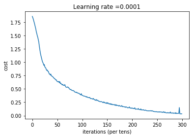
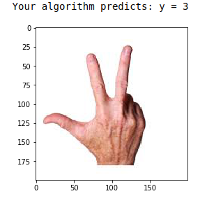

# Sign-Language-Detector
Repo containing the codes for recognising 0 - 5 in sign language using Deep Neural Networks

An explanation of how to represent the labels using one hot encoding. These are the original pictures, before lowering the image resolutoion to 64 by 64 pixels.

**The model** is *LINEAR -> RELU -> LINEAR -> RELU -> LINEAR -> SOFTMAX*.

**Training* ::

###  Test with your own image 
You can now take a picture of your hand and see the output of your model. To do that:
    1. Add your image to this Jupyter Notebook's directory, in the "images" folder
    2. Write your image's name in the following code
    3. Run the code and check if the algorithm is right!
    
Sample Test ::

